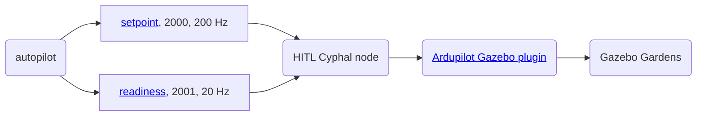
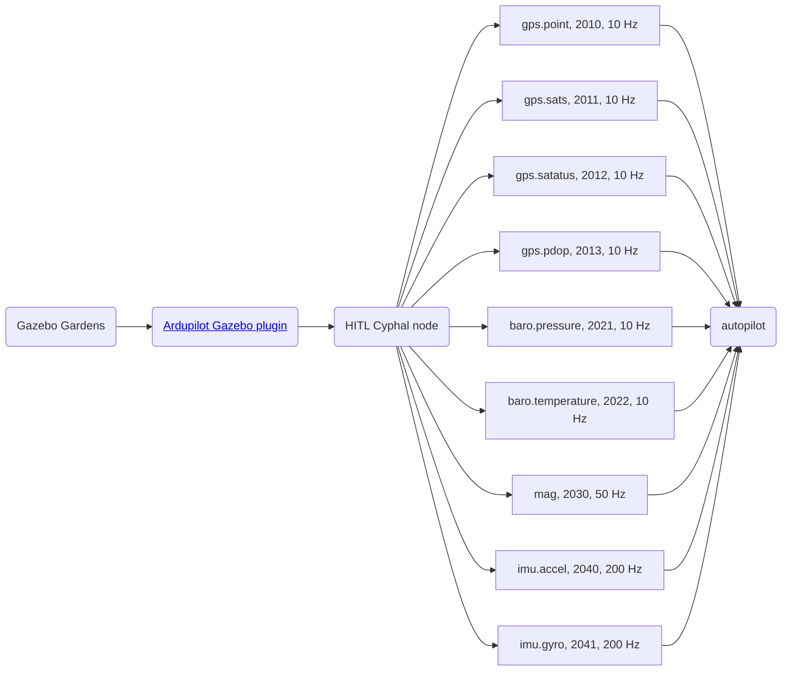
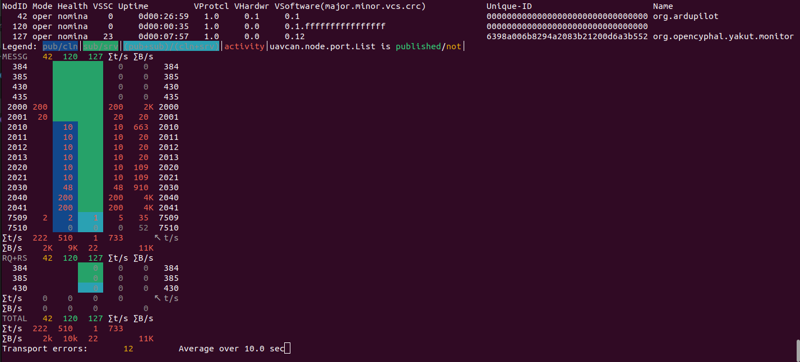

# Ardupilot HITL

## 1. Prerequisites

Hardware:

- ArduPilot compatible autopilot with at least 2 MB flash memory and CAN bus
- CAN-sniffer

Software:

- QGC or any other ground control station software,
- Cyphal related utilies such as Yukon, Yakut, nunavut, etc

## 2. Usage

1. Install Gazebo Garden and the ArduPilot Gazebo plugin according to [the official ArduPilot instructions](https://ardupilot.org/dev/docs/sitl-with-gazebo.html#sitl-with-gazebo) and run Gazebo Simulator

```bash
gz sim -v4 -r -s --headless-rendering iris_runway.sdf
```

> It is recommended to use the headless mode because the simulator is very real-time sensitive.

2. Connect CAN-sniffer to PC and create SLCAN

An example of how you can create SLCAN:

```bash
source scripts/init.sh
```

3. Build and Run Cyphal HITL application

```bash
# Clone with submodules
git clone git@github.com:RaccoonlabDev/libcanard_cyphal_application.git --recursive
cd libcanard_cyphal_application

# Generate DSDL
./scripts/nnvg_generate_c_headers.sh

# Build
mkdir -p build/hitl
cd build/hitl
cmake ../../examples/autopilot_hitl && make

# Run
./application
```

4. Connect an autopilot with PC and sniffer

> It is expected that your firmware is based on custom branch [cyphal-hitl](https://github.com/PonomarevDA/ardupilot/tree/cyphal-hitl)

```bash
cd Ardupilot
git checkout cyphal-hitl
./waf configure --board CUAVv5
./waf --targets bin/arducopter --upload
```

In result your connection scheme might be as follows:


> At the time of writing, only CAN1 is supported.

5. Configure autopilot and reboot

```bash
cd scripts
./ardupilot_gazebo_cyphal_quadcopter.py
```

6. Wait until you get a message `EKF3 IMU0 is using GPS` and then fly

## 3. How does it work?

## 3.1. Actuator command flow



### 3.1. Sensors data flow



### 3.3. Yakut


