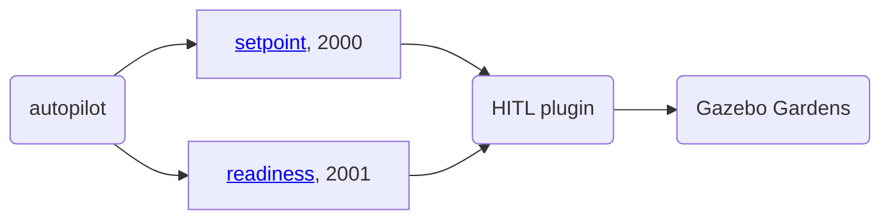
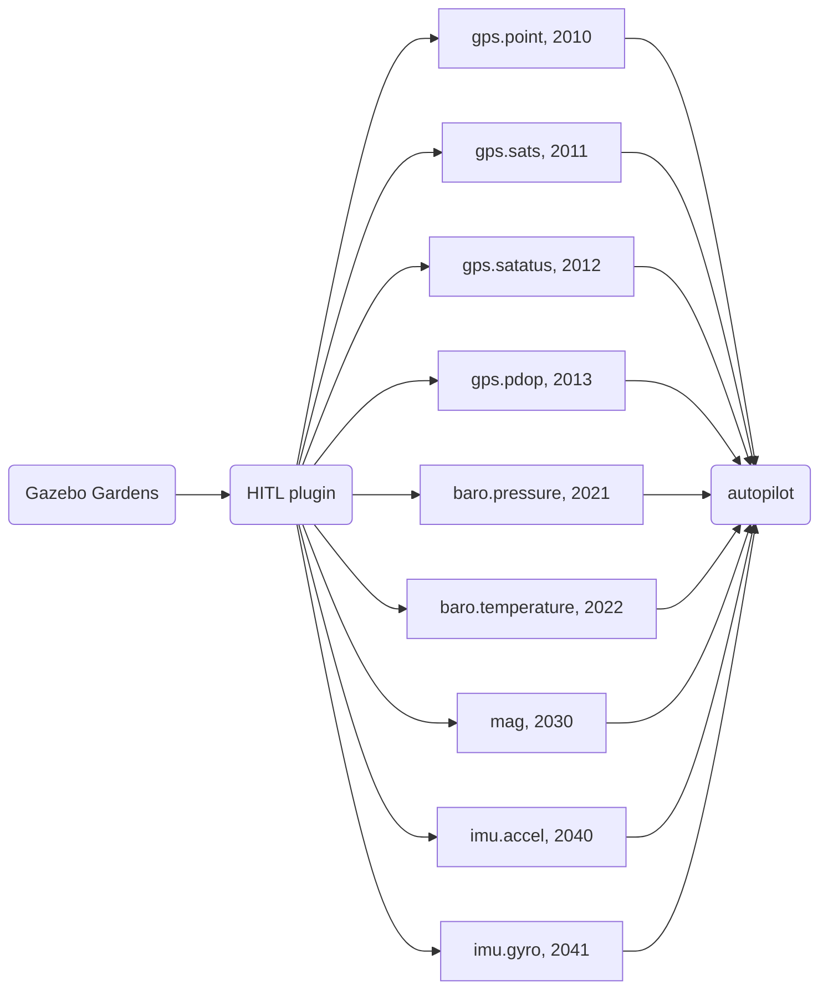

# hitl

## Actuator command flow

```mermaid
flowchart LR

hw(autopilot)
hitl(HITL plugin)
gz(Gazebo Gardens)
hitl --> gz

setpoint[<a href='https://github.com/OpenCyphal/public_regulated_data_types/blob/master/reg/udral/service/actuator/common/sp/Vector4.0.1.dsdl'>setpoint</a>, 2000]
readiness[ <a href='https://github.com/OpenCyphal/public_regulated_data_types/blob/master/reg/udral/service/common/Readiness.0.1.dsdl'>readiness</a>, 2001]

hw --> setpoint --> hitl
hw --> readiness --> hitl
```

## Sensors data flow

```mermaid
flowchart LR

hw(autopilot)
hitl(HITL plugin)
gz(Gazebo Gardens)


hitl --> gps_point[ gps.point, 2010] --> hw
hitl --> gps_sats[ gps.sats, 2011] --> hw
hitl --> gps_status[ gps.satatus, 2012] --> hw
hitl --> gps_pdop[ gps.pdop, 2013] --> hw
hitl --> baro_pressure[ baro.pressure, 2021] --> hw
hitl --> baro_temperature[ baro.temperature, 2022] --> hw
hitl --> mag[ mag, 2030] --> hw
hitl --> imu_accel[ imu.accel, 2040] --> hw
hitl --> imu_gyro[ imu.gyro, 2041] --> hw
gz --> hitl
```
