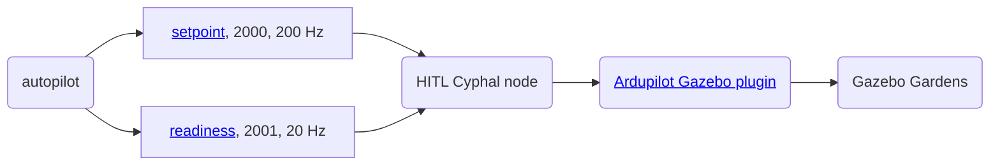
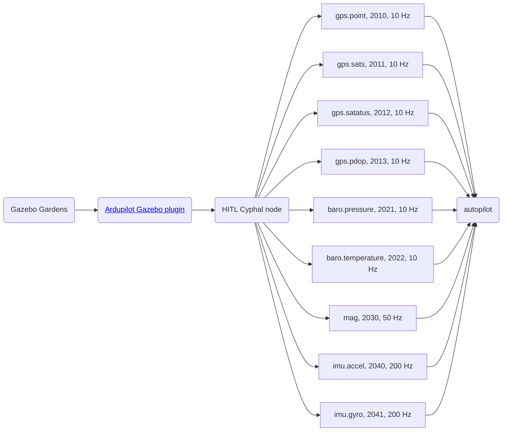

# Ardupilot HITL

## 1. Usage

1. Run gazebo simulator

```bash
gz sim -v4 -r -s --headless-rendering iris_runway.sdf
```

2. Connect CAN-sniffer to PC and create SLCAN

3. Build and Run Cyphal HITL application

```bash
# Build once
git clone git@github.com:RaccoonlabDev/libcanard_cyphal_application.git --recursive
cd libcanard_cyphal_application
mkdir -p build/hitl
cd build/hitl
cmake ../../tests/autopilot_hitl && make

# Run
./application
```

4. Connect an autopilot with PC and sniffer

5. Fly when it is ready to fly

## 2. How does it work?

## 2.1. Actuator command flow



### 2.1. Sensors data flow



### 2.3. Yakut


